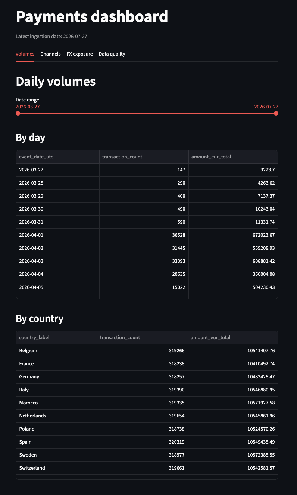
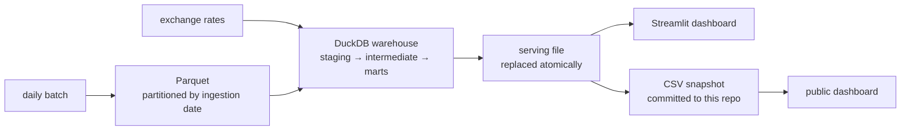
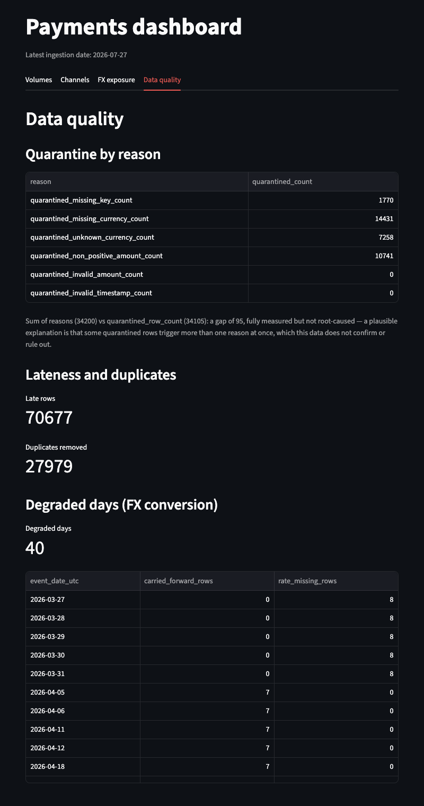

# Payments batch platform

[](https://github.com/medanouarzaki/payments-batch-platform/actions/workflows/ci.yml)

A daily batch pipeline that turns messy payment extracts into aggregates you can trust,
and says plainly where that trust ends.

**[See the dashboard running →](https://payments-batch-platform.streamlit.app)** — no
install required. It sleeps after twelve hours without visitors; if you land on a
sleeping page, one click wakes it.

## The problem

A payment system drops one file per day. The rows in it arrive late, arrive twice, and
carry amounts formatted three different ways in currencies that are not all the same.
Anyone who wants to answer "how much did we process yesterday, in euros" has to solve
late arrivals, duplicates, parsing, and currency conversion first — and get the same
answer twice if they ask twice.

This repository does that, for 118 days of transactions, and keeps a record of every row
it refused and why.



## What it does

- **Lands** each day once, atomically, as Hive-partitioned Parquet. Never rewrites a day.
- **Validates** every row, and quarantines the invalid ones with their reasons rather
  than dropping them.
- **Deduplicates** deterministically inside a bounded window: same input, same winner.
- **Converts** to euros against published daily rates, recording per row which rate was
  used, how old it was, and why no conversion happened when none did.
- **Refuses to publish** a day whose quarantine share crosses a threshold.
- **Publishes** six tables to a serving file, replaced atomically, so a reader never
  competes with the writer for the database.

## Architecture



Python and Parquet for ingestion, DuckDB as the warehouse, dbt for the transformations,
Airflow in Docker Compose for orchestration, Streamlit for the dashboard. Everything runs
on one machine; the only external dependency is a public exchange rate API.

`docs/architecture.md` has the full picture: every model, every edge, and what runs where.

## The numbers

| | |
|---|---|
| Ingestion dates | 118, from 2026-04-01 to 2026-07-27 |
| Rows received | 3,588,450 |
| Rows in the fact table | 3,526,366 |
| Rows quarantined as invalid | 34,105 |
| Duplicates removed | 27,979 |
| Rows that arrived after their event date | 70,677 |
| dbt models | 9 |
| dbt tests | 78 |
| Python tests | 191, plus 17 for the dashboard |
| Coverage of the pipeline package | 95.4%, with a blocking floor at 90% |
| Decision records | 22, plus a template |

Every count in the first six rows can be recomputed from this repository alone, without
running anything: `dashboard/snapshot/` holds a committed CSV copy of the published
tables. `docs/quality.md` explains how, and states what is *not* guaranteed.

## Run it

Requires Python 3.11 and [uv](https://docs.astral.sh/uv/). Timings measured on an Apple M3,
on a clean clone with an empty package cache.

```
git clone https://github.com/medanouarzaki/payments-batch-platform.git
cd payments-batch-platform
make install        # 12 s, 762 MB of downloads
make test           # 4 min 34 s, 191 tests
make nightly        # 8 s on a fresh clone, 12 s once a warehouse exists
```

`make nightly` replays the nine steps of the daily pipeline outside any scheduler. On a
fresh checkout there is no warehouse yet, so it says so and treats the run as day one, which
is the shorter of the two timings. On a machine that already holds a warehouse it replays
the most recent day instead, and pays a few seconds more for the incremental work.

To see the result:

```
make dashboard-install   # 11 s
make dashboard           # http://localhost:8501
```

It prints that URL rather than opening a browser: `.streamlit/config.toml` pins the server
to headless mode, so a first launch on a machine where Streamlit has never run does not stop
on its welcome prompt.

`make install` is not hermetic. The lock file records every dependency with its hash, and
that includes `dbt-core-experimental-parser`, which `dbt-core` pulls in — but that package is
published as a source distribution only, and building it downloads a prebuilt wheel from a
GitHub release page. That download is outside the lock file, so a bad minute on GitHub stops
the install: I hit a 503 on it once, on a cold start from a clean clone. Running
`make install` again was enough.

`docs/getting-started.md` walks the same path step by step, with what each one writes and
what to check when one of them does not behave.

For the orchestrated version, the replay commands, and what to do when something breaks,
see `docs/operations.md`.

## Decisions

Twenty-two decision records live in `docs/decisions/`, each with the alternatives that were
rejected and why. The ones that shaped the rest:

- [DuckDB as the warehouse](docs/decisions/0001-use-duckdb-as-the-analytical-warehouse.md)
  — one file, no server, and the reason that choice constrains everything downstream.
- [Quarantine invalid rows instead of dropping them](docs/decisions/0005-quarantine-invalid-rows-instead-of-dropping-them.md)
  — why a rejected row still has to be counted.
- [Deterministic deduplication with a bounded window](docs/decisions/0006-deterministic-deduplication-with-a-bounded-window.md)
  — what the window buys, and what it silently excludes.
- [A separate serving layer](docs/decisions/0010-separate-the-serving-layer-into-its-own-file-and-environment.md)
  — measured from a lock error, not assumed.
- [Rebuild after a retroactive rate correction](docs/decisions/0019-rebuild-the-warehouse-after-a-retroactive-rate-correction.md)
  — what a content fingerprint is for, and what it caught.
- [Verify each published guarantee by mutation](docs/decisions/0022-verify-each-published-guarantee-by-mutation.md)
  — two of the eight properties this repository advertised were tested by nothing.

## What is in here

```
src/payments/     ingestion, generator, rate client, publication
dbt/              9 models, 2 seeds, 78 tests, 5 macros
airflow/          the daily DAG and its four scripts
dashboard/        four views, a local entry point and a public one
docs/             architecture, data model, quality, operations, decisions
.github/          six CI jobs, plus a nightly run of the whole chain
```



## What this is not

A production system. The warehouse is a single file on one machine with no replication
and no backup; there is no alerting, only exit codes; secrets sit in a local file rather
than a secret manager; and the rate source has no fallback. The data is synthetic, from a
seeded generator with deliberately injected defects — realistic in shape, not in origin.

The last section of `docs/operations.md` lists what would have to change, in the order it
would matter.
