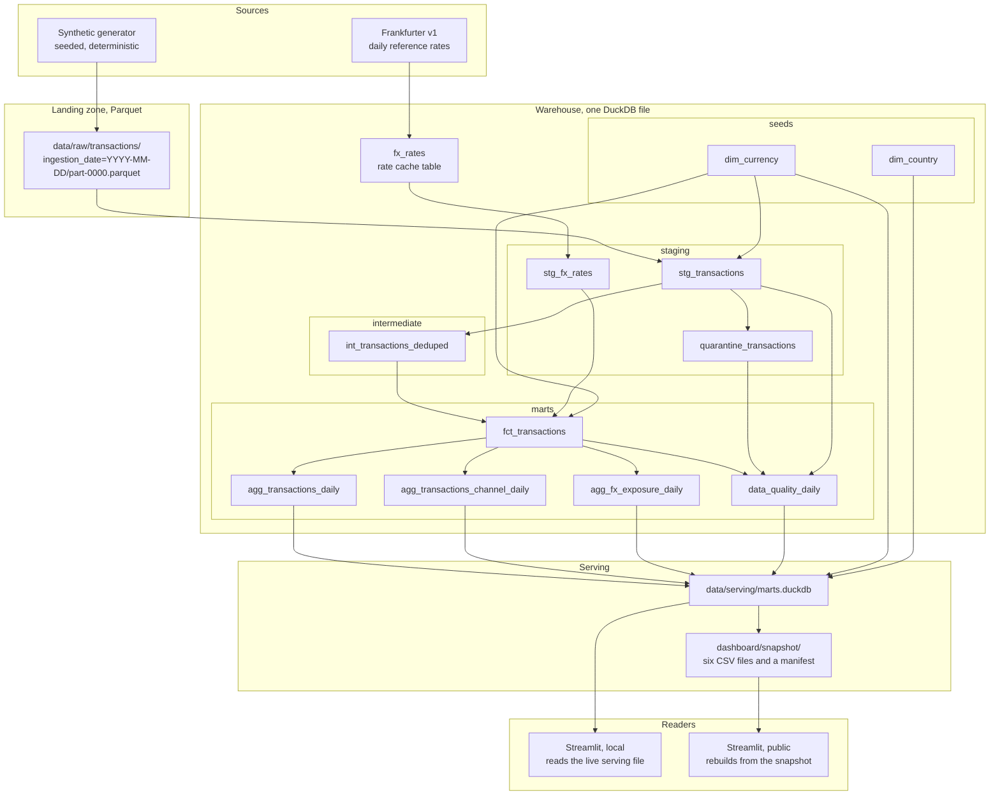
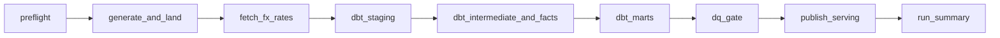

# Architecture

A daily batch of payment transactions arrives as a file. It arrives late, duplicated,
and inconsistently typed. This repository turns that file into aggregates that can be
read without knowing any of that, and states plainly what it does not guarantee.

Everything runs on one machine. The warehouse is a single DuckDB file, the orchestrator
is Airflow in Docker Compose, and the only external dependency is a public exchange rate
API. There is no cloud account, no managed service, and no credential beyond the ones
Compose creates locally.

## Data flow

**Landing.** Each day's batch is written once, atomically, to a Hive-partitioned Parquet
directory keyed by ingestion date. The landing zone is append-only: a day already landed
is never rewritten. The repository currently holds 118 such partitions.

**Staging.** dbt reads the Parquet files directly through a DuckDB source, so no copy
step stands between the landing zone and the warehouse. `stg_transactions` parses and
types every column, computes a row hash, and marks each row valid or not.
`quarantine_transactions` keeps the invalid ones with the reasons they failed, rather
than dropping them. `stg_fx_rates` is the only view in the project; everything else is
incremental.

**Intermediate.** `int_transactions_deduped` removes duplicates within a bounded window
anchored on the most recent ingestion date. The window is what makes the model
incremental rather than a full rescan, and it is also the reason a partition older than
that window is not reconsidered.

**Marts.** `fct_transactions` joins the deduplicated rows to the rate table and converts
amounts to euros, recording for every row which rate was used, how old it was, and why
no conversion happened when none did. The three aggregates and the quality table are
built from it. `data_quality_daily` is the only model that reads the quarantine table,
because it is the one that has to account for rows that never reached the fact table.

**Serving.** The daily run publishes six tables to a separate DuckDB file, replaced
atomically rather than edited in place. A separate file exists because DuckDB refuses a
reader while a writer holds the database, so a dashboard reading the warehouse directly
would fail during every run. A second, text-only copy of those six tables is committed
to the repository as CSV with a manifest carrying every column, its type, its row count
and its content fingerprint; it is what the public dashboard rebuilds from, and it never
touches the warehouse.

## Orchestration

The DAG is strictly linear. Nothing here is wide enough to be worth parallelising, and
the warehouse is a single file: every task holds a one-slot pool, so two runs can never
write to it at once. Catch-up is off, because replaying an old day would convert its
amounts with today's rate cache rather than the cache as it stood then, and would
therefore not reproduce that day. Range replays go through an explicit Makefile target
instead.

The three dbt tasks depend on the previous run of the same task, so a failed day blocks
the next one rather than building on a half-written warehouse. `dq_gate` fails the run
when the share of quarantined rows for the day exceeds a threshold passed as a DAG
parameter, which stops a bad batch before it is published rather than after.

Airflow's own interpreter never imports DuckDB or the pipeline package: the official
image ships an incompatible DuckDB version, so every task shells out to an isolated
virtual environment inside the image.

## What runs where

| Component | Where it runs | What it reads | What it writes |
|---|---|---|---|
| Generator and landing | Host or container | Nothing | Parquet partitions |
| Rate client | Host or container | Frankfurter v1 | `fx_rates` in the warehouse |
| dbt | Isolated venv in the Airflow image | Parquet and the warehouse | The warehouse |
| Publication | Same venv | The warehouse | `data/serving/marts.duckdb` |
| Snapshot export | Host | The serving file, read-only | `dashboard/snapshot/` |
| Local dashboard | Its own venv | The serving file, read-only | Nothing |
| Public dashboard | Streamlit Community Cloud | The committed snapshot | A temporary database |

The two dashboards share every view and every query. They differ only in where the data
comes from, and that difference is confined to the entry point.

## Related documents

- `docs/data-model.md` describes the raw contract, the injected defects, and how the
  generator stays deterministic.
- `docs/decisions/` records the decisions this architecture rests on, with the
  alternatives that were rejected and why.
